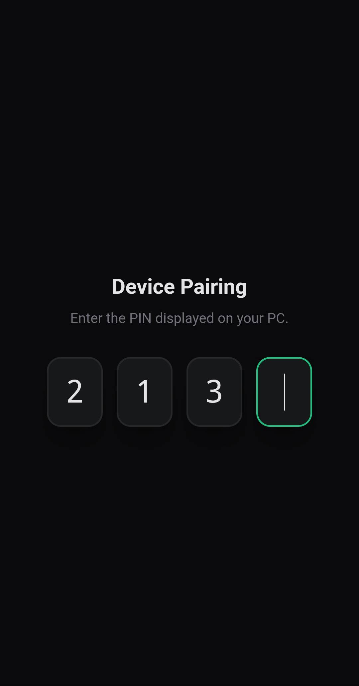
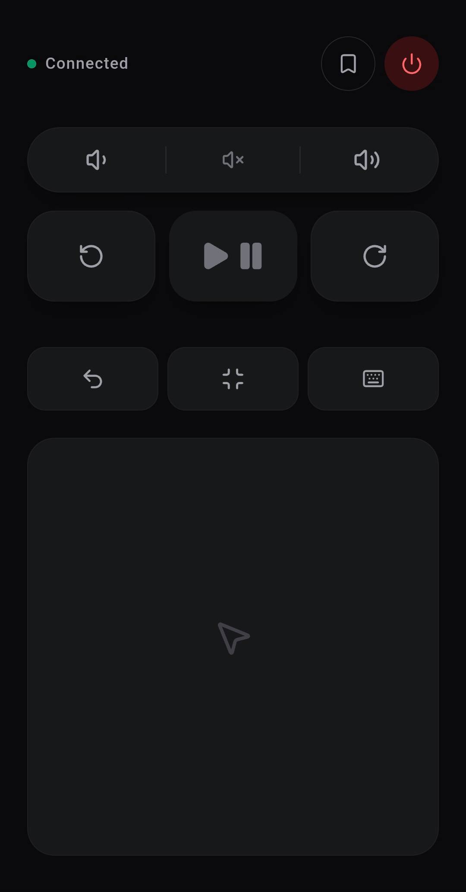
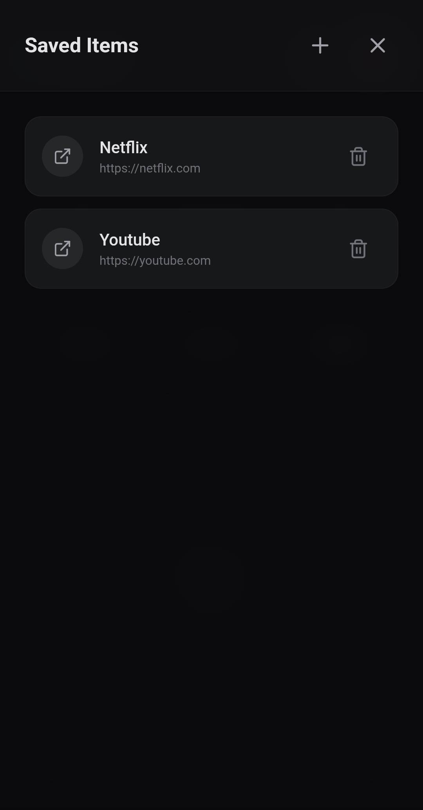

# Desktop Remote

Turn your smartphone into a wireless remote for your (Windows) PC. No app downloads and cloud accounts. Everything is served to your mobile browser and runs entirely over local Wi-Fi.

---

<p align="center">
    
    
    
</p>

---

## Features

- **Zero App Installation:** Connect via your phone's web browser.
- **Real-time Control:** Mouse and keyboard input powered by SignalR WebSockets.
- **Media & Audio:** Control system volume, play/pause, and more - natively.
- **Saved Drawer:** Pin and launch any website instantly.
- **Secure Pairing:** Connect devices using a randomly generated PIN.
- **System Tray Native:** Runs quietly in the background.

---

## How to Use

1. Launch **Desktop Remote** from your Start Menu.
2. Look for the icon in your Windows System Tray (near the clock).
3. Right-click the icon and select **Show QR Code**.
4. Scan the QR code with your phone's camera.
5. Enter the **Pairing PIN** displayed on your PC screen (or system tray).
6. You now have full control of your PC.

> **Managing Devices:** To revoke a device's access, right-click the tray icon, click "Paired Devices", and click Revoke. It instantly severs the connection.

---

## Development Setup

### Prerequisites

- [.NET 10 SDK](https://dotnet.microsoft.com/download)
- [Node.js](https://nodejs.org/)

### 1. Frontend Setup (React)

```bash
cd Client
npm install
```

Create a `.env` file in the `Client` directory and define the server port (match this to whatever port you set in the backend's `Program.cs`):

```env
VITE_SERVER_PORT=7546 # Default Server Port
```

Start the local development server:

```bash
npm run dev
```

### 2. Backend Setup (C# API)

```bash
cd Server/Api
dotnet run
```

### 3. Building for Production

The `.csproj` is wired up to automatically build the React frontend and embed it directly into the C# `wwwroot` folder during a Release build.

To generate the standalone executable:

```bash
dotnet publish -c Release
```
